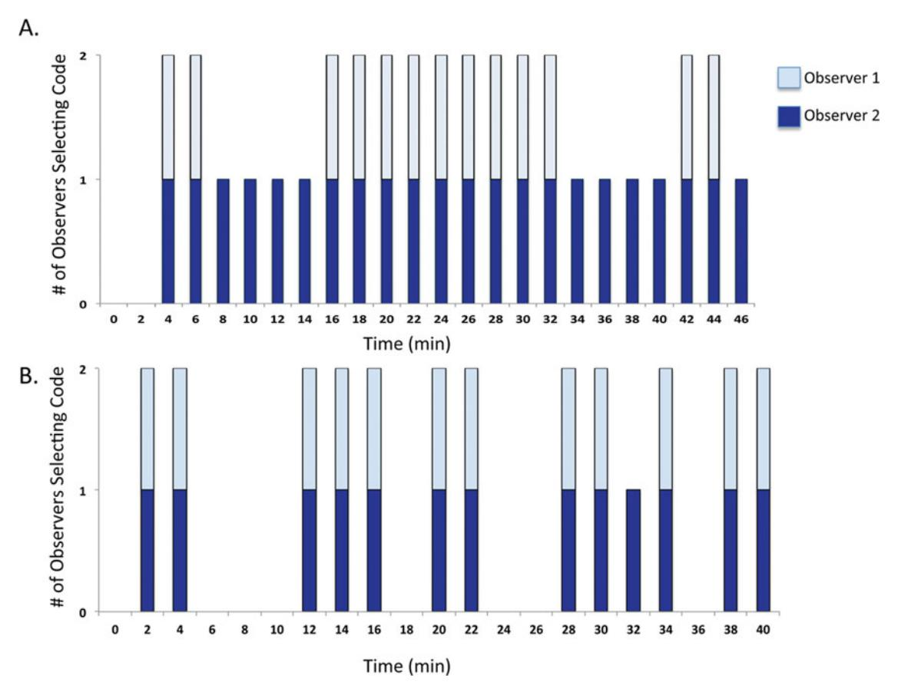
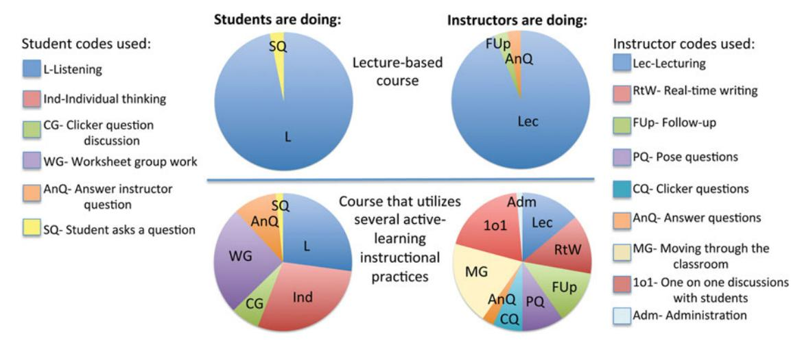
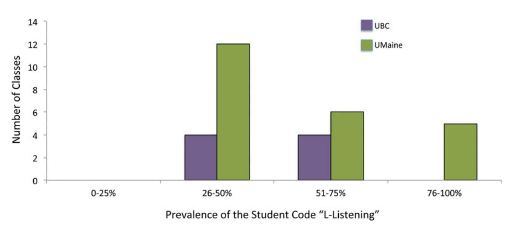
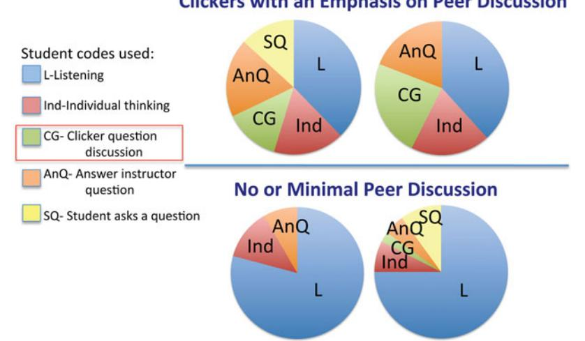

# Article

# The Classroom Observation Protocol for Undergraduate STEM (COPUS): A New Instrument to Characterize University STEM Classroom Practices

Michelle K. Smith,\* Francis H. M. Jones,† Sarah L. Gilbert,‡ and Carl E. Wieman‡

\*School of Biology and Ecology and Maine Center for Research in STEM Education, University of Maine–Orono, Orono, ME 04469-5751; †Department of Earth, Ocean, and Atmospheric Sciences, University of British Columbia, Vancouver, BC V6T 1Z4, Canada; ‡Carl Wieman Science Education Initiative, University of British Columbia, Vancouver, BC V6T 1Z3, Canada

Submitted August 10, 2013; Revised September 8, 2013; Accepted September 9, 2013 Monitoring Editor: Erin L. Dolan

Instructors and the teaching practices they employ play a critical role in improving student learning in college science, technology, engineering, and mathematics (STEM) courses. Consequently, there is increasing interest in collecting information on the range and frequency of teaching practices at department-wide and institution-wide scales. To help facilitate this process, we present a new classroom observation protocol known as the Classroom Observation Protocol for Undergraduate STEM or COPUS. This protocol allows STEM faculty, after a short 1.5-hour training period, to reliably characterize how faculty and students are spending their time in the classroom. We present the protocol, discuss how it differs from existing classroom observation protocols, and describe the process by which it was developed and validated. We also discuss how the observation data can be used to guide individual and institutional change.

### INTRODUCTION

A large and growing body of research indicates that undergraduate students learn more in courses that use active-engagement instructional approaches (Prince, 2004; Knight and Wood, 2005; Michael, 2006; Blanchard *et al.*, 2010). As a result, the importance of teaching science, technology, engineering, and mathematics (STEM) courses more effectively has been stressed in numerous reports, including the President's Council of Advisors on Science and Technology *Engage to Excel* report (2012), the National Science Foundation/American Association for the Advancement of Science *Vision and Change* 

DOI: 10.1187/cbe.13-08-0154

Address correspondence to: Michelle K. Smith (michelle.k.smith@maine.edu).

© 2013 M. K. Smith *et al. CBE—Life Sciences Education* © 2013 The American Society for Cell Biology. This article is distributed by The American Society for Cell Biology under license from the author(s). It is available to the public under an Attribution–Noncommercial–Share Alike 3.0 Unported Creative Commons License (http://creativecommons.org/licenses/by-nc-sa/3.0).

"ASCB®" and "The American Society for Cell Biology®" are registered trademarks of The American Society for Cell Biology.

report (AAAS, 2010), and the National Research Council *Discipline-Based Education Research* report (Singer *et al.*, 2012). Given these compelling, evidence-based recommendations and the recognized need for measures of teaching effectiveness beyond student evaluations (Association of American Universities, 2011), higher education institutions are struggling to determine the extent to which faculty members are teaching in an interactive manner. This lack of information is a major barrier to transforming instruction and evaluating the success of programs that support such change.

To collect information about the nature of STEM teaching practices as a means to support institutional change, faculty at both the University of British Columbia (UBC) and the University of Maine (UMaine) created classroom observation programs. The results of such observations were needed to: 1) characterize the general state of STEM classroom teaching at both institutions, 2) provide feedback to instructors who desired information about how they and their students were spending time in class, 3) identify faculty professional development needs, and 4) check the accuracy of the faculty reporting on the Teaching Practices Survey that is now in use at UBC (CWSEI Teaching Practices Survey, 2013).

To achieve these goals, the programs needed an observation protocol that could be used by faculty member observers to reliably characterize how students and instructors were spending their time in undergraduate STEM classrooms. A critical requirement of the protocol was that observers who were typical STEM faculty members could achieve those results with only 1 or 2 hours of training, as it is unrealistic to expect they would have more time than that available. In the quest for a suitable observation protocol, multiple existing options were considered, and ultimately rejected.

The observation protocols considered were divided into two categories: open-ended or structured. When observers use open-ended protocols, they typically attend class, make notes, and respond to such statements as: "Comment on student involvement and interaction with the instructor" (Millis, 1992). Although responses to these types of questions can provide useful feedback to observers and instructors, the data are observer dependent and cannot easily be standardized or compared across multiple classrooms (e.g., all STEM courses at UBC or UMaine).

Alternatively, structured protocols provide a common set of statements or codes to which the observers respond. Often, these protocols ask observers to make judgments about how well the teaching conforms to a specific standard. Examples of such protocols include the Inside the Classroom: Observation and Analytic Protocol (Weiss *et al.*, 2003) and the Reformed Teaching Observation Protocol (RTOP; Sawada *et al.*, 2002). These protocols consist of statements that observers typically score on a Likert scale from "not at all" to "to a great extent" and contain such statements as: "The teacher had a solid grasp of the subject matter content inherent in the lesson" (from RTOP; Sawada *et al.*, 2002).

The RTOP in particular has been used to observe university STEM instruction. For example, it has been used to evaluate university-level courses at several different institutions to measure the effectiveness of faculty professional development workshops (Ebert-May *et al.*, 2011) and to compare physics instructors in a study examining coteaching as a method to help new faculty develop learner-centered teaching practices (Henderson *et al.,* 2011). The RTOP is also being used to characterize classroom practices in many institutions and in all levels of geoscience classes (Classroom Observation Project, 2011).

The RTOP was found to be unsuitable for the UBC and UMaine programs for two main reasons. The first is that the protocol involves many observational judgments that can be awkward to share with the instructor and/or the larger university community. The second is that observers must complete a multiday training program to achieve acceptable interrater reliability (IRR; Sawada *et al.*, 2002).

More recently, new observation protocols have been developed that describe instructional practices without any judgment as to whether or not the practices are effective or aligned with specific pedagogic strategies. These observation protocols use a series of codes to characterize instructor and/or student behaviors in the classroom; observers indicate how often each behavior occurs during a class period (Hora *et al.*, 2013; West *et al.*, 2013). One observation protocol in particular, the Teaching Dimensions Observation Protocol (TDOP), was expressly developed to observe postsecondary nonlaboratory courses. For this protocol, observers document classroom behaviors in 2-min intervals throughout the duration of the class session (Hora *et al.*, 2013). The possible classroom behaviors are described in 46 codes in six categories, and observers make a checkmark when any of the behaviors occur.

The TDOP instrument avoids the judgment issues associated with the RTOP, but it still requires substantial training, as one might expect for a protocol that was designed to be a complex research instrument. Preliminary work suggests that, after a 3-day training session, observers have acceptable IRR scores when using the TDOP (Hora *et al.*, 2013). Observers at our institutions tried using this instrument, but without the full training, they found it difficult to use the TDOP in a reliable way, due to the complexity of the items being coded and the large number of possible behavior codes. We also found that the particular research questions it was designed to address did not entirely align with our needs. For example, it covers some aspects that are not necessary for faculty observation programs, such as whether an instructor uses instructional artifacts (e.g., a laser pointer or computer; Hora *et al.*, 2013) and fails to capture others that are needed, such as whether an instructor encourages peer discussion along with clicker questions (Mazur, 1997; Smith *et al.*, 2009, 2011). We also wanted to better characterize the student behaviors during the class period than the TDOP easily allowed.

Out of necessity, we created a new protocol called the Classroom Observation Protocol for Undergraduate STEM, or COPUS. Like the TDOP, this new protocol documents classroom behaviors in 2-min intervals throughout the duration of the class session, does not require observers to make judgments of teaching quality, and produces clear graphical results. However, COPUS is different in that it is limited to 25 codes in only two categories ("What the students are doing" and "What the instructor is doing") and can be reliably used by university faculty with only 1.5 hours of training (Figure 1 has a description of the codes; the Supplemental Material includes the full protocol and coding sheet). Observers who range from STEM faculty members without a background in science education research to K–12 STEM teachers have reliably used this protocol to document instruction in undergraduate science, math, and engineering classrooms. Taken together, their results show the broad usability of COPUS.

# **DEVELOPMENT**

The development of COPUS was an evolutionary process extending across more than 2 years, involving many iterations and extensive testing. It began at UBC, where science education specialists (SESs) who were working with science faculty on improving teaching (Wieman *et al.*, 2010) wanted to characterize what both the students and instructors were doing during class. The SESs began testing various existing protocols, including the TDOP, in different classes at UBC in late 2011 and early 2012. The original TDOP did not meet our needs (as described above), so we iteratively modified the protocol through nine different versions. These changes resulted in a format, procedure, data structure, and coding strategy that was easy to implement on paper or electronically and convenient for analysis and display. The overall format of the observation protocol remained largely stable, but the categories and codes continued to evolve.

During the Fall term of 2012, 16 SESs, who are highly trained and experienced classroom observers, used this evolving protocol to observe a variety of courses in singles,

### 1. Students are Doing

Listening to instructor/taking notes, etc.

Ind Individual thinking/problem solving. Only mark when an instructor explicitly asks students to think about a clicker question or another question/problem on their own

CG Discuss clicker question in groups of 2 or more students

WG Working in groups on worksheet activity

OG Other assigned group activity, such as responding to instructor question

AnQ Student answering a question posed by the instructor with rest of class listening

SQ Student asks question

WC Engaged in whole class discussion by offering explanations, opinion, judgment, etc. to whole class, often facilitated by instructor

Prd Making a prediction about the outcome of demo or experiment

SP Presentation by student(s)

TQ Test or quiz

W Waiting (instructor late, working on fixing AV problems, instructor otherwise occupied, etc.)

O Other - explain in comments

### 2. Instructor is Doing

Lec Lecturing (presenting content, deriving mathematical results, presenting a problem solution, etc.)

RtW Real-time writing on board, doc. projector, etc. (often checked off along with Lec)

FUp Follow-up/feedback on clicker question or activity to entire class

PQ Posing non-clicker question to students (non-rhetorical)

CQ Asking a clicker question (mark the entire time the instructor is using a clicker question, not just when first asked)

AnQ Listening to and answering student questions with entire class listening

MG Moving through class guiding ongoing student work during active learning task

101 One-on-one extended discussion with one or a few individuals, not paying attention to the rest of the class (can be along with MG or AnQ)

D/V Showing or conducting a demo, experiment, simulation, video, or animation

Adm Administration (assign homework, return tests, etc.)

W Waiting when there is an opportunity for an instructor to be interacting with or observing/listening to student or group activities and the instructor is not doing so

O Other - explain in comments

**Figure 1.** Descriptions of the COPUS student and instructor codes.

pairs, or trios across most of the departments in the UBC Faculty of Science (including the disciplines of biology, computer science, earth sciences, mathematics, physics, and statistics). We analyzed the SES generated observation data to identify coding disagreements and met with the SESs to discuss the evolving protocol and coding. These discussions covered observed behaviors they found difficult to code and/or hard to interpret, and other important elements of instructor or student behavior they felt were not being adequately captured. The protocol evolved through five different versions during this stage of testing and feedback. The final version had substantially simplified categories and all identified problems with the wording on the codes had been eliminated. Notably, it was quite simple to reliably code classes taught with traditional lectures, as a very small number of behaviors need to be coded. Therefore, the majority of the work went into improving the protocol so it could reliably characterize classes that had substantial and varied interactions between instructor and students and multiple student activities.

One substantial change during Fall 2012 was eliminating a category for judging the cognitive level of the activities. Observers had been asked to code the level of cognitive sophistication of current classroom activities, based on Bloom's taxonomy of educational objectives (Bloom *et al.*, 1956). After multiple unsuccessful attempts to find a simple and reliable coding scheme that could capture this aspect of the classroom activities, we dropped this category. Our decision to drop this category is supported by recent work showing that, when faculty members write and evaluate higher-order questions,

they use several criteria beyond the Bloom's level, including: question difficulty, time required to answer the questions, whether students are using a new or well-practiced approach, and whether the questions have multiple reasonable solutions (Lemons and Lemons, 2012).

The second substantial change during this time was changing another category—coding the level of student engagement—from required to optional. Having a measure of student engagement is useful for providing feedback to the instructor and for judging the overall effectiveness of many instructional activities. With the coding of the levels of engagement simplified to only discriminating between low (0-20%) of the students engaged), medium, or high  $(\geq 80\%)$  of the student engaged), some observers, particularly those who had some experience with observing levels of student engagement, could easily code engagement along with the other two categories, and there was reasonable consistency between observers. However, less-experienced observers found it quite hard to simultaneously code what the students were doing, what the instructor was doing, and the student engagement level. Also, there were difficulties with obtaining consistent coding of student engagement across all observers; the judgments were often dependent on the levels of engagement common to the specific disciplines and courses with which the observers were familiar. For this reason, the student engagement category was made optional. We recommend observers do not try to code it until after they have become experienced at coding the "What the students are doing" and "What the instructor is doing" categories.

Another recurring theme of the discussions with the SESs was the extent to which classroom observations could accurately capture the quality of instruction or the efficacy of student work. In the end, after SESs observed different classes across many disciplines, there was a consensus that accurately evaluating the quality of instruction and the efficacy of student work was generally not possible. These highly trained and experienced observers concluded that these evaluations require a high degree of training of the observer in the material and the pedagogic strategies, as well as familiarity with the student population (prior knowledge, typical classroom behaviors, etc.). We concluded that quality judgments of this type were not realistic goals for limited classroom observations carried out by STEM faculty members. Thus, the present version of COPUS captures the actions of both instructors and students, but does not attempt to judge the quality of those actions for enhancing learning.

After the completion of this development work at UBC, the COPUS was further tested by 16 K–12 teachers participating in a teacher professional development program at UMaine. The teachers used the COPUS to observe 16 undergraduate STEM courses in five different departments (biology, engineering, math, chemistry, and physics). While the teachers easily interpreted many of the codes, they found a few to be difficult and suggested additional changes. For example, the student code "Listening: paying attention/taking notes, etc." was changed to "Listening to instructor/taking notes, etc." The code was clarified, so observers knew they should select this code only when the students were listening to their instructor, not when students were listening to their peers. Also, new codes were added to capture behaviors the teachers thought were missing, such as the instructor code "AnQ: Listening to and answering student questions with entire class listening."

The coding patterns of the two teacher observers in the same classroom were also compared to determine which specific codes were difficult to use consistently. An example comparing two teachers employing the student code "Ind" is shown in Figure 2. Figure 2A compares how two observers marked this code in the first iteration of testing, when it was described "Ind: Individual thinking/problem solving in response to assigned task." Observer 2 marked this code throughout most of the class, and observer 1 marked this code intermittently. Follow-up conversations with observer 2 and other teachers indicated that some observers were marking this code throughout the duration of the class, because they assumed individual students were thinking while they were taking notes, working on questions, and so on, but other observers were not. Therefore, we clarified the code to be: "Ind: Individual thinking/problem solving. Only mark when an instructor explicitly asks students to think about a clicker question or another question/problem on their own."

**Figure 2.** A comparison of how two observers coded the student code "Ind." (A) When the code was described as "Ind: Individual thinking/problem solving in response to assigned task," observer 2 marked this code more often than observer 1 did. (B) Coding after description of the code was revised.

**Table 1.** Information on the courses observed using the final version of the COPUS

| Institution | Number of classes | Number of different | Percentage of courses at the | Percentage of classes |
|-------------|-------------------|---------------------|------------------------------|-----------------------|
|             | observed          | STEM departments    | introductory levela          | with >100 students    |
| UBC         | 8                 | 4b                  | 100                          | 63                    |
| UMaine      | 23                | 7c                  | 96                           | 35                    |

aSTEM courses at the first- and second-year levels.

Figure 2B shows a comparison of the same observer pair, with the revised "Ind" code showing how the paired codes were now closely aligned.

In addition, the teacher observation data revealed a more general problem: there was a lower degree of consistency in coding student behaviors than in coding instructor behaviors, and the teachers used a very limited set of codes for the student behaviors. The earlier coding by the SESs had shown similar, but less dramatic, trends. We realized that this problem was due to a natural tendency of observers to focus on the instructor, combined with the fact the instructor-related codes came first on the survey form. Therefore, the protocol was changed, with the student codes viewed first, and we emphasized coding student behaviors during subsequent training sessions (see further details below in the *Training* section). As shown below, these changes appear to have fixed this problem.

These further revisions culminated in a final version of the COPUS. This version was tested by having the same 16 K–12 teachers use it to observe 23 UMaine STEM classes, and by having seven STEM faculty observers use it to observe eight UBC classrooms in pairs after 1.5 hours of training. Information about the types of classes observed is in Table 1. The seven UBC STEM faculty member volunteers who used the final protocol had not previously used the protocol and were not involved in the development process. Thus, the IRR of the protocol has been tested with a sample of observers with a wide range of backgrounds and perspectives. As discussed in *Validity and Reliability*, the IRR was high.

# **TRAINING**

A critical design feature of the COPUS is that college and university faculty who have little or no observation protocol experience and minimal time for training can use it reliably. We summarize the training steps in the following paragraphs, and we have also included a step-by-step facilitator guide in the Supplemental Material.

The first step in the training process is to have the observers become familiar with the codes. At UBC, facilitators displayed the student and instructor codes (Figure 1) and discussed with the observers what each behavior typically looks like in the classroom. At UMaine, the teacher observers played charades. Each teacher randomly selected a code description from a hat and silently acted out the behavior. The remaining observers had the code descriptions in front of them and guessed the code. The remainder of the training was the same for both groups, with a total training duration of 2 hours for the K–12 teachers and 1.5 hours for the UBC faculty members.

Second, observers were given paper versions of the coding sheet and practiced coding a 2-min segment of a classroom video. An excerpt from the coding sheet is shown in Figure 3, and the complete coding sheet is included in the Supplemental Material. Observers often mark more than one code within a single 2-min interval. The first video we used showed an instructor making administrative announcements and lecturing while the class listened. After 2 min, the video was paused, and the group discussed which codes they selected. Because faculty at other institutions may have difficulty capturing videos for training, we have included web URLs to various video resources that can be used for training (Table 2).

The observers were then asked to form pairs and code 8 min of a video from a large-enrollment, lecture-style science class at UMaine that primarily shows an instructor lecturing and students listening, with a few questions asked by both the instructor and students. To keep the observers synchronized and ensure they were filling out a new row in the observation protocol at identical 2-min intervals, they used either cell phones set to count time up or a sand timer. At

|       | 1. Students doing |     |    |    |    |     |    |    |     | 2. Instructor doing |    |   |   |     |     |     |    |    |     |    |     |     |     |   |   |           |
|-------|-------------------|-----|----|----|----|-----|----|----|-----|---------------------|----|---|---|-----|-----|-----|----|----|-----|----|-----|-----|-----|---|---|-----------|
| min   | ٦                 | Ind | CG | WG | OG | AnQ | SQ | WC | Prd | SP                  | TQ | W | 0 | Lec | RtW | FUp | PQ | CQ | AnQ | MG | 101 | D/V | Adm | W | 0 | Comments: |
| 0 - 2 |                   |     |    |    |    |     |    |    |     |                     |    |   |   |     |     |     |    |    |     |    |     |     |     |   |   |           |
| 2-4   |                   |     |    |    |    |     |    |    |     |                     |    |   |   |     |     |     |    |    |     |    |     |     |     |   |   |           |
| 4-6   |                   |     |    |    |    |     |    |    |     |                     |    |   |   |     |     |     |    |    |     |    |     | 3   |     |   |   |           |

**Figure 3.** An excerpt of the COPUS coding form. Observers place a single checkmark in the box if a behavior occurs during a 2-min segment. Multiple codes can be marked in the same 2-min block.

bBiology, chemistry, math, and physics.

cBiology, molecular biology, engineering, chemistry, math, physics, and geology.

Table 2. Video resources that may be helpful for COPUS training

| Description of video                                                                                                                                      | URL                                                                                                                                                                                                                                                                                                                                         |  |  |  |  |  |
|-----------------------------------------------------------------------------------------------------------------------------------------------------------|---------------------------------------------------------------------------------------------------------------------------------------------------------------------------------------------------------------------------------------------------------------------------------------------------------------------------------------------|--|--|--|--|--|
| Demonstration, clicker questions, and lecture Group activities and lecture Clicker questions and lecture Clicker, real-time writing, and lecture | http://harvardmagazine.com/2012/02/interactive-teaching http://podcasting.gcsu.edu/4DCGI/Podcasting/UGA/Episodes/12746/614158822.mov http://podcasting.gcsu.edu/4DCGI/Podcasting/UGA/Episodes/22253/27757327.mov http://ocw.mit.edu/courses/chemistry/5-111-principles-of-chemical-science-fall-2008/ video-lectures/lecture-19 |  |  |  |  |  |
| Real-time writing, asking/answering questions, and lecture                                                                                                | http://ocw.mit.edu/courses/biology/7-012-introduction-to-biology-fall-2004/video-lectures/lecture-6-genetics-1                                                                                                                                                                                                                              |  |  |  |  |  |

the end of 8 min, the observers compared their codes with their partners. Next, as a large group, observers took turns stating what they coded for the students and the instructor every 2 min for the 8-min video clip. At this point, the observers talked about the relationship between a subset of the student and instructor codes. For example, if the observers check the student code "CG: Discuss clicker question," they will also likely check the instructor code "CQ: Asking a clicker question."

To provide the observers with practice coding a segment that has more complicated student and instructor codes, they next coded a different classroom video segment from the same large-enrollment, lecture-style science class at UMaine, but this time the camera was focused on the students. This video segment included students asking the instructor questions, students answering questions from the instructor, and clicker questions with both individual thought and peer discussion. The observers coded 2 min and then paused to discuss the codes. Then observers in pairs coded for an additional 6 min, again taking care to use synchronized 2-min increments. The observer pairs first compared their codes with their partners, and then the whole group discussed the student and instructor codes for each of the 2-min segments of the 6-min clip. At this point, the training was complete.

### **VALIDITY AND RELIABILITY**

COPUS is intended to describe the instructor and student actions in the classroom, but it is not intended to be linked to any external criteria. Hence, the primary criterion for validity is that experts and observers with the intended background (STEM faculty and teachers) see it as describing the full range of normal classroom activities of students and instructors. That validity was established during the development process by the feedback from the SESs, the K–12 teachers, and those authors (M.S., F.J., C.W.) who have extensive experience with STEM instruction and classroom observations.

A major concern has been to ensure that there is a high level of IRR when COPUS is used after the brief period of training described above. To assess the IRR, we examined the agreement between pairs of observers as they used the final version of COPUS in STEM classes at both UBC and UMaine. The two observers sat next to each other in the classroom, so they could keep identical 2-min time increments, but the observers were instructed not to compare codes with each other.

To summarize how similarly observer pairs used each code on the final version of the COPUS, we calculated Jaccard similarity scores (Jaccard, 1901) for each code and then averaged the scores for both the UBC and UMaine observers (Table 3).

**Table 3.** Average Jaccard similarity scores for COPUS codes across all pairs observing in all courses for both UBC faculty observers and Maine K–12 teacher observers; numbers closer to 1 indicate the greatest similarity between two observers

| Student code                                                     | UBC          | UMaine       | Instructor code                                 | UBC  | UMaine |
|------------------------------------------------------------------|--------------|--------------|-------------------------------------------------|------|--------|
| L: Listening                                                     | 0.95         | 0.96         | Lec: Lecturing                                  | 0.91 | 0.92   |
| Ind: Individual thinking/problem solving                         | 0.97         | 0.91         | RtW: Real-time writing                          | 0.93 | 0.93   |
| CG: Discuss clicker question                                     | 0.98         | 0.97         | FUp: Follow-up on clicker questions or activity | 0.92 | 0.85   |
| WG: Working in groups on worksheet activity                      | 0.98         | 0.99         | PQ: Posing nonclicker questions                 | 0.86 | 0.80   |
| OG: Other group activity                                         | Not used     | 0.97         | CQ: Asking a clicker question                   | 0.93 | 0.97   |
| AnQ: Students answer question posed by instructor                | 0.91         | 0.84         | AnQ: Answering student questions                | 0.94 | 0.89   |
| SQ: Student asks question                                        | 0.96         | 0.93         | MG: Moving through the class                    | 0.96 | 0.97   |
| WC: Engaged in whole-class discussion                            | 0.96         | 0.98         | 1o1: One-on-one discussions with students       | 0.94 | 0.96   |
| Prd: Making a prediction about the outcome of demo or experiment | Not used     | 1.00         | D/V: Conducting a demo, experiment, etc.        | 0.97 | 0.98   |
| SP: Presentation by students a                        | Not used     | Not used     | Adm: Administration                             | 0.94 | 0.97   |
| TQ: Test or quiz a                                    | Not used     | Not used     | W: Waiting                                      | 0.95 | 0.98   |
| W: Waiting O: Other                                           | 0.99 0.94 | 0.98 0.99 | O: Other                                        | 0.97 | 1.00   |

a "SP: Presentation by students" and "TQ: Test/quiz" were not selected in any of the observations at UBC or UMaine. This result likely occurred because when we asked UBC and UMaine faculty members if we could observe their classes, we also asked them if there was anything unusual going on in their classes that day. We avoided classes with student presentations and tests/quizzes, because these situations would limit the diversity of codes that could be selected by the observers.

For single codes, we calculated Jaccard similarity scores instead of IRR Cohen's kappa values, because observer pairs occasionally marked the same code for every 2-min increment throughout the duration of the class. For example, in a class that is lecture-based, observers would likely mark the student code "L: Listening" for the entire time. In a case such as this, the observer opinion is defined as a constant rather than a variable, which interferes with the IRR calculation.

The equation for the Jaccard coefficient is  $T = n_c/(n_a + n_b)$  $-n_c$ ), where  $n_c$  = the number of 2-min increments that are marked the same (either checked or not checked) for both observers,  $n_a$  = the number of 2-min increments that are marked the same for both observers plus 2-min increments observer 1 marked that observer 2 did not,  $n_b =$  number of 2-min increments that are marked the same for both observers plus 2-min increments observer 2 marked that observer 1 did not. For example, for the data in Figure 2B, the class period is 42 min in length, so there are 21 possible 2-min segments. The student code "Ind: Individual thinking" was marked 12 times by observers 1 and 2, not marked eight times by both observers, and marked by observer 2 one time when observer 1 did not. Therefore, the calculation is:  $\frac{20}{(20 + 21 - 20)} = 0.95$ . Numbers closer to 1 indicate greater consistency between how the two observers coded the class.

Eighty-nine percent of the similarity scores are greater than 0.90, and the lowest is 0.80. These values indicate strong similarity between how two observers use each code. The lowest score for both the UBC and UMaine observers was for the instructor code "PQ: Posing nonclicker questions." Comments from observers suggest that, when instructors were following up/giving feedback on clicker questions or activities, they often posed questions to the students. Observers checked the instructor code "FUp: Follow-up" to describe this behavior but stated they occasionally forgot to also select the instructor code "PO."

To compare observer reliability across all 25 codes in the COPUS protocol, we calculated Cohen's kappa IRR scores using SPSS (IBM, Armonk, NY). To compute the kappa values for each observer pair, we added up the total number of times: 1) both observers put a check in the same box, 2) neither observer put a check in the same box, 3) observer 1 put a check in a box when observer 2 did not, and 4) observer 2 put a check in a box when observer 1 did not. For example, at UBC, when looking at all 25 codes in the COPUS, one observer pair had the following results: 1) both observers put a check in 83 of the same boxes, 2) neither observer put a check in 524 of the boxes, 3) observer 1 marked six boxes when observer 2 did not, and 4) observer 2 marked 12 boxes that observer 1 did not. Using data such as these, we computed the kappa score for each of the eight UBC and 23 UMaine pairs and report the average scores in Table 4. We also repeated this calculation using either the subset of 13 student or 12 instructor codes (Table 4).

The average kappa scores ranged from 0.79 to 0.87 (Table 4). These are considered to be very high values for kappa and thus indicate good IRR (Landis and Koch, 1977). Notably, the kappa values, as well as the Jaccard similarity scores, are comparably high for both UBC faculty and UMaine K–12 teacher observers, indicating that COPUS is reliable when used by observers with a range of backgrounds and 2 hours or fewer of training.

### ANALYZING COPUS DATA

To determine the prevalence of different codes in various classrooms, we added up how often each code was marked by both observers and then divided by the total number of codes shared by both observers. For example, if both observers marked "Instructor: Lecture" at the same 13 time intervals in a 50-min class period and agreed on marking 25 instructor codes total for the duration of the class, then 13/25, or 52% of the time, the lecture code occurred for the instructor.

We visualized the prevalence of the student and instructor codes using pie charts. Figure 4 shows observation results from two illustrative classes: one that is primarily lecture-based and one in which a combination of active-learning strategies are used. The latter class is clearly differentiated from the lecture-based class. This example illustrates how, at a glance, this visual representation of the COPUS results provides a highly informative characterization of the student and instructor activities in a class.

At a department- or institution-wide level, there are several ways to categorize the range of instructional styles. One of the simplest is to look at the prevalence of the student code "L: Listening to instructor/taking notes, etc." across all courses observed, because this student code is the most indicative of student passive behavior in response to faculty lecturing ("Lec") with or without real-time writing ("RtW"). Figure 5 shows that at both institutions the "L" code was marked 26–75% of the time. However, at UMaine, some of the classes have greater than 76% of the student codes devoted to listening. Faculty who teach these classes may benefit from professional development activities about how to design an effective active-learning classroom.

In addition, the data can be analyzed for a subset of faculty members who are using active-learning strategies, such as asking clicker questions. Thirty-eight percent of UBC and 43% of the UMaine classes that were observed used clickers. However, student code prevalence in these classes show that not all faculty members used clicker questions accompanied by recommended strategies, such as peer discussion (Mazur, 1997; Smith *et al.*, 2009, 2011; Figure 6). Faculty members who are not allowing time for peer discussion may benefit from professional development on how to integrate peer discussion into clicker questions.

**Table 4.** Average IRR kappa scores from the observations at UBC and UMaine

| 0 11                                                               |                            |                            |                              |
|--------------------------------------------------------------------|----------------------------|----------------------------|------------------------------|
| Observers                                                          | All codes ( $\pm$ SE)      | Student codes ( $\pm$ SE)  | Instructor codes ( $\pm$ SE) |
| Faculty observing UBC courses Teachers observing UMaine courses | 0.83 (0.03) 0.84 (0.03) | 0.87 (0.04) 0.87 (0.04) | 0.79 (0.04) 0.82 (0.04)   |

**Figure 4.** A comparison of COPUS results from two courses that have different instructional approaches.

**Figure 5.** Prevalence of the student code "L: Listening" across several UBC and UMaine classes.

**Figure 6.** Prevalence of student codes in four example courses that use clickers. In courses that use clickers with no or minimal peer discussion, the students are passively listening the majority of the time.

# **DISCUSSION AND SUMMARY**

COPUS was developed because university observation programs needed a protocol to: 1) characterize the general state of teaching, 2) provide feedback to instructors who desired information about how they and their students were spending class time, and 3) identify faculty professional development needs. COPUS meets all of these goals by allowing observers with little observation protocol training and experience to reliably characterize what both faculty and students are doing in a classroom.

There are several uses for COPUS data. On an individual level, faculty members can receive pie charts with their code prevalence results (examples in Figure 4). These results provide a nonthreatening way to help faculty members evaluate how they are spending their time. We discovered that faculty members often did not have a good sense of how much time they spent on different activities during class, and found COPUS data helpful.

In addition, faculty members can use COPUS data in their tenure and promotion documents to supplement their normal documentation, which typically includes student evaluation information and a written description of classroom practices. Having observation data gives faculty members substantially more information to report about their use of active-learning strategies than is usually the case.

COPUS data can also be used to develop targeted professional development. For example, anonymized, aggregate COPUS data across all departments have been shared with the UMaine Center for Excellence in Teaching and Assessment, so workshops and extended mentoring opportunities can better target the needs of the faculty. One area in particular that will be addressed in an upcoming professional development workshop is using clickers in a way that promotes peer discussion. The idea for this workshop came about as a result of the COPUS evidence showing the prevalence of UMaine STEM classes that were using clickers but allowing no or minimal time for recommended student peer discussions (Figure 6).

Other planned uses for COPUS include carrying out systematic observations of all instructors in a department at UBC in order to characterize teaching practices. The information will be used with other measures to characterize current usage of research-based instructional practices across the department's courses and curriculum.

In the end, the choice of observation protocol and strategy will depend on the needs of each unique situation. COPUS is easy to learn, characterizes nonjudgmentally what instructors and students are doing during a class, and provides data that can be useful for a wide range of applications, from improving an individual's teaching or a course to comparing practices longitudinally or across courses, departments, and institutions.

## **ACKNOWLEDGMENTS**

This work was supported at UBC through the Carl Wieman Science Education Initiative and by the National Science Foundation under grant #0962805. We are grateful for the assistance of all of the UBC SESs who contributed to the development of the survey; Lisa McDonnell and Bridgette Clarkston for running the UBC training session; MacKenzie Stetzer, Susan McKay, Erika Allison, Medea Steinman, and Joanna Meyer for helping to run the UMaine training session; Jeremy Smith for developing scripts to parse and analyze the data; the Maine K–12 teachers and UBC faculty volunteers who served as observers; and the faculty at UBC and UMaine who allowed their courses to be observed.

Approval to observe classrooms and instruction at UBC and publish results of that work is provided to the Carl Wieman Science Education Initiative by the University of British Columbia under the policy on institutional research. Approval to evaluate teacher observations of classrooms (exempt status, protocol no. 2013-02-06) was granted by the Institutional Review Board at the University of Maine.

# **REFERENCES**

American Association for the Advancement of Science (2010). Vision and Change: A Call to Action, Washington, DC.

Association of American Universities (2011). Five-Year Initiative for Improving Undergraduate STEM Education, AAU, Washington, DC. [www.aau.edu/WorkArea/DownloadAsset.aspx?id=14357](http://www.aau.edu/WorkArea/DownloadAsset.aspx?id=14357) (accessed 7 August 2013).

Blanchard MR, Southerland SA, Osborne JW, Sampson VD, Annetta LA, Granger EM (2010). Is inquiry possible in light of accountability? A quantitative comparison of the relative effectiveness of guided inquiry and verification laboratory instruction. Sci Educ *94*, 577–616.

Bloom B, Engelhart MD, Furst EJ, Hill WH, Krathwohl DR (1956). Taxonomy of Educational Objectives: The Classification of Educational Goals, Handbook I: Cognitive Domain, New York: David McKay.

Classroom Observation Project (2011). Classroom Observation Project: Understanding and Improving Our Teaching Using the Reformed Teaching Observation Protocol (RTOP). [http://](http://serc.carleton.edu/NAGTWorkshops/certop/about.html) [serc.carleton.edu/NAGTWorkshops/certop/about.html](http://serc.carleton.edu/NAGTWorkshops/certop/about.html) (accessed 7 August 2013).

CWSEI Teaching Practices Survey (2013). [http://www.cwsei.ubc.ca/](http://www.cwsei.ubc.ca/resources/TeachPracticeSurvey.htm) [resources/TeachPracticeSurvey.htm](http://www.cwsei.ubc.ca/resources/TeachPracticeSurvey.htm) (accessed 29 October 2013).

Ebert-May D, Derting TL, Hodder J, Momsen JL, Long TM, Jardeleza SE (2011). What we say is not what we do: effective evaluation of faculty professional development programs. BioSci *61*, 550–558.

Henderson C, Beach A, Finkelstein N (2011). Facilitating change in undergraduate STEM instructional practices: an analytic review of the literature. J Res Sci Teach *48*, 952–984.

Hora MT, Oleson A, Ferrare JJ (2013). Teaching Dimensions Observation Protocol (TDOP) User's Manual, Madison: Wisconsin Center for Education Research, University of Wisconsin– Madison. [http://tdop.wceruw.org/Document/TDOP-Users-Guide](http://tdop.wceruw.org/Document/TDOP-Users-Guide.pdf) [.pdf \(accessed 7 August 2013\).](http://tdop.wceruw.org/Document/TDOP-Users-Guide.pdf)

Jaccard P (1901). Etude comparative de la distribution florale dans ´ une portion des Alpes et des Jura. Bull de la Societ´ e Vaudoise des Sci ´ Nat *37*, 547–579.

Knight JK, Wood WB (2005). Teaching more by lecturing less. Cell Biol Educ *4*, 298–310.

Landis JR, Koch GG (1977). The measurement of observer agreement for categorical data. Biometrics *33*, 159–174.

Lemons PP, Lemons JD (2012). Questions for assessing higher-order cognitive skills: it's not just Bloom's. CBE Life Sci Educ *12*, 47–58.

Mazur E (1997). Peer Instruction, Upper Saddle River, NJ: Prentice Hall.

Michael J (2006). Where's the evidence that active learning works? Adv Physiol Educ *30*, 159–167.

Millis B (1992). Conducting effective peer classroom observations. [http://digitalcommons.unl.edu/cgi/viewcontent.cgi?article=1249&](http://digitalcommons.unl.edu/cgi/viewcontent.cgi?article=1249&context=podimproveacad) [context=podimproveacad](http://digitalcommons.unl.edu/cgi/viewcontent.cgi?article=1249&context=podimproveacad) (accessed 28 October 2013).

President's Council of Advisors on Science and Technology (2012). Report to the President: Engage to Excel: Producing One Million Additional College Graduates with Degrees in Science, Technology, Engineering, and Mathematics, Washington, DC: Executive Office of the President. [www.whitehouse.gov/sites/default/](http://www.whitehouse.gov/sites/default/files/microsites/ostp/pcast-engage-to-excel-v11.pdf) [files/microsites/ostp/pcast-engage-to-excel-v11.pdf](http://www.whitehouse.gov/sites/default/files/microsites/ostp/pcast-engage-to-excel-v11.pdf) (accessed 7 August 2013).

Prince M (2004). Does active learning work? A review of the research. J Eng Educ *93*, 223–231.

Sawada D, Piburn MD, Judson E, Turley J, Falconer K, Benford R, Bloom I (2002). Measuring reform practices in science and mathematics classrooms: the Reformed Teaching Observation Protocol. Sch Sci Math *102*, 245–253.

Singer SR, Nielsen NR, Schweingruber HA (2012). Discipline-Based Education Research: Understanding and Improving Learning in Undergraduate Science and Engineering, Washington, DC: National Academies Press.

Smith MK, Wood WB, Adams WK, Wieman C, Knight JK, Guild N, Su TT (2009). Why peer discussion improves student performance on in-class concept questions. Science *323*, 122–124.

Smith MK, Wood WB, Krauter K, Knight JK (2011). Combining peer discussion with instructor explanation increases student learning from in-class concept questions. CBE Life Sci Educ *10*, 55–63.

Weiss IR, Pasley JD, Smith PS, Banilower ER, Heck DJ (2003). Looking Inside the Classroom: A Study of K–12 Mathematics and Science Education in the United States, Chapel Hill, NC: Horizon Research.

West EA, Paul CA, Webb D, Potter WH (2013). Variation of instructorstudent interactions in an introductory interactive physics course. Phys Rev ST Phys Educ Res *9*, 010109.

Wieman C, Perkins K, Gilbert S (2010). Transforming science education at large research universities: a case study in progress. Change *42*, 7–14.